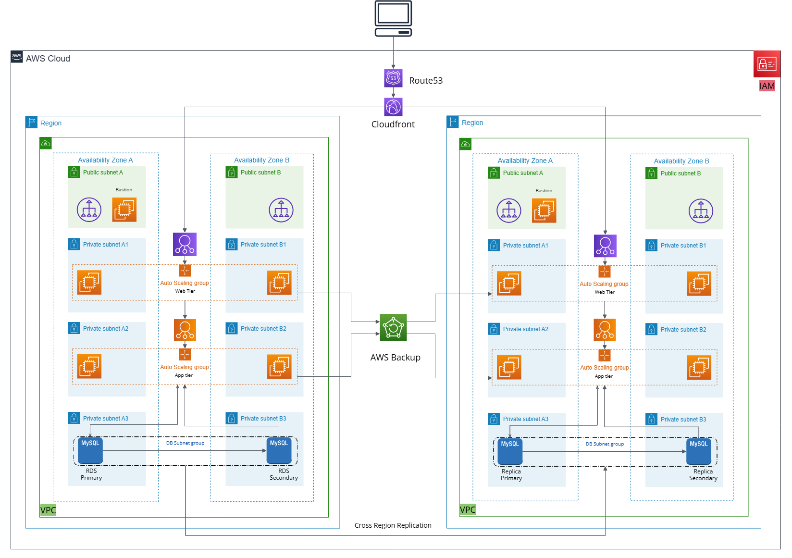

# Three-Tier Architecture on AWS using Terraform

## Overview
This project implements a highly available and scalable three-tier architecture on AWS using Terraform. The architecture consists of:
- **Web Tier**: Hosted on EC2 instances in private subnets.
- **App Tier**: Hosted on EC2 instances in private subnets.
- **DB Tier**: Hosted on RDS (MySQL) in private subnets.
- **Disaster Recovery**: Implemented in a secondary region using AWS Backup, CloudFront, and Route53.

## Architecture Diagram


## AWS Services Used
- **EC2**: For hosting web and app tiers.
- **VPC**: For network isolation and subnets.
- **IAM**: For role-based access control.
- **RDS (MySQL)**: For the database tier.
- **Route53**: For DNS management.
- **CloudFront**: For content delivery and disaster recovery.
- **S3**: For static assets and backups.
- **AWS Backup**: For automated backups.
- **NAT Gateway**: For outbound internet access from private subnets.
- **Bastion Host**: For secure access to private instances.

## Features
- High availability across 2 Availability Zones (AZs).
- Disaster recovery in a secondary region.
- Automated backups using AWS Backup.
- Secure access using IAM roles and Bastion Host.

## Prerequisites
- AWS Account
- Terraform (for infrastructure as code)
- AWS CLI


## Terraform Configuration
The Terraform configuration for this project is organized as follows:
- **main.tf**: Contains the main configuration for the AWS resources.
- **variables.tf**: Defines the variables used in the configuration.
- **outputs.tf**: Defines the outputs of the Terraform configuration.
- **modules/**: Contains reusable modules for different components of the architecture.


## Variables
The following variables are used in the Terraform configuration:
- `web_instance_count`: Number of web tier instances.
- `web_instance_ami`: AMI ID for the web tier instances.
- `web_instance_type`: Instance type for the web tier instances.
- `app_instance_count`: Number of app tier instances.
- `app_instance_ami`: AMI ID for the app tier instances.
- `app_instance_type`: Instance type for the app tier instances.
- `db_instance_class`: Instance class for the RDS instance.
- `db_engine_version`: MySQL engine version for the RDS instance.
- `db_name`: Name of the database.
- `db_username`: Username for the database.
- `db_password`: Password for the database.

## Outputs
The following outputs are defined in the Terraform configuration:
- `web_tier_instance_ids`: IDs of the web tier instances.
- `app_tier_instance_ids`: IDs of the app tier instances.
- `rds_endpoint`: Endpoint of the RDS instance.
- `bastion_host_public_ip`: Public IP of the Bastion Host.

## Deployment

This project is organized into three folders, each containing Terraform configurations that must be applied sequentially. Follow the steps below to deploy the three-tier architecture on AWS.

### Step 1: Clone the Repository
Clone the repository to your local machine:
```bash
git clone https://github.com/gskumar-lab/3-tier-app-infra-terraform.git
```

### Step 2: Navigate to the Project Directory
Move into the project directory:
```bash
cd 3-tier-app-infra-terraform
```

### Step 3: Deploy the AMI and EC2 Configuration
1. Navigate to the `1-ami-ec2` folder:
   ```bash
   cd 1-ami-ec2
   ```
2. Initialize Terraform:
   ```bash
   terraform init
   ```
3. Review the Terraform plan:
   ```bash
   terraform plan
   ```
4. Apply the Terraform configuration:
   ```bash
   terraform apply
   ```
5. Confirm the apply by typing `yes` when prompted.

### Step 4: Deploy the Infrastructure in `us-west-2`
1. Navigate to the `2-us-west-2` folder:
   ```bash
   cd ../2-us-west-2
   ```
2. Initialize Terraform:
   ```bash
   terraform init
   ```
3. Review the Terraform plan:
   ```bash
   terraform plan
   ```
4. Apply the Terraform configuration:
   ```bash
   terraform apply
   ```
5. Confirm the apply by typing `yes` when prompted.

### Step 5: Deploy the Infrastructure in `us-east-1` (Disaster Recovery)
1. Navigate to the `3-us-east-1` folder:
   ```bash
   cd ../3-us-east-1
   ```
2. Initialize Terraform:
   ```bash
   terraform init
   ```
3. Review the Terraform plan:
   ```bash
   terraform plan
   ```
4. Apply the Terraform configuration:
   ```bash
   terraform apply
   ```
5. Confirm the apply by typing `yes` when prompted.

---

### Notes:
- Ensure you have the necessary AWS credentials configured for Terraform to access your AWS account.
- The configurations in `1-ami-ec2`, `2-us-west-2`, and `3-us-east-1` must be applied in sequence, as they depend on outputs from previous steps.
- After deployment, you can access the outputs (e.g., instance IDs, RDS endpoint, Bastion Host IP) from the Terraform outputs in each folder.

### Cleanup
To destroy the resources created by Terraform, navigate to each folder in reverse order (`3-us-east-1`, `2-us-west-2`, `1-ami-ec2`) and run:
```bash
terraform destroy
```
Confirm the destruction by typing `yes` when prompted.
